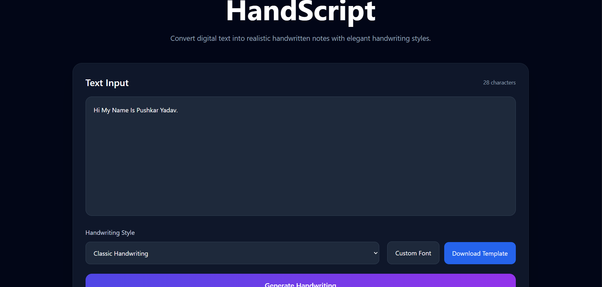
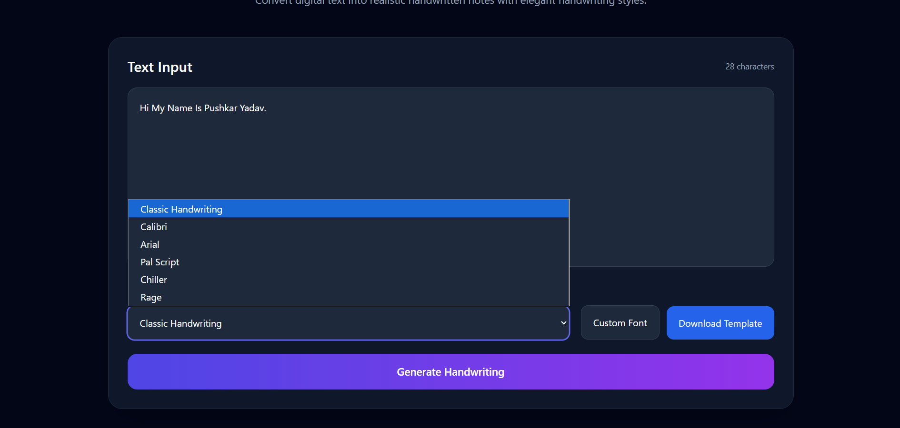
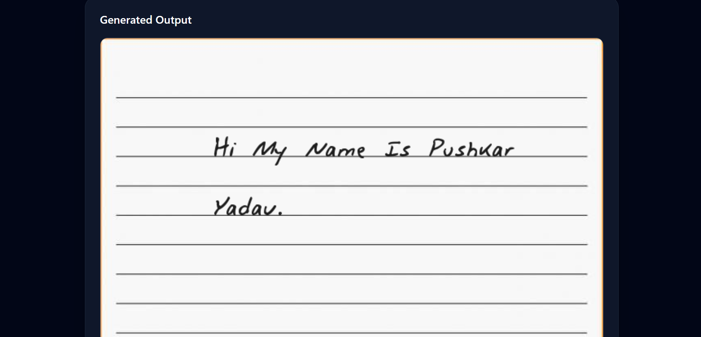
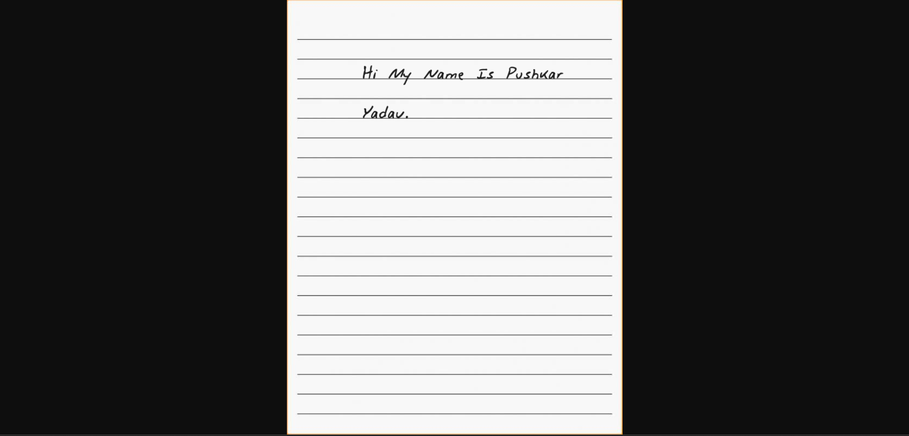

<div align="center">

# ✍️ HandScript

### Convert Digital Text into Realistic Handwritten Notes

Generate handwritten-style notebook pages using custom handwriting fonts, dynamic image rendering, and a modern full-stack web interface.

<br/>

[](https://hand-script-delta.vercel.app/)

[]()
[]()
[]()

</div>

---

# 📸 Screenshots

## Main Interface

<p align="center">
  
</p>

---

## Font Selection System

<p align="center">
  
</p>

---

## Generated Handwriting Output

<p align="center">
  
</p>

---

## Download Generated Notes

<p align="center">
  
</p>

---

# 🚀 About HandScript

HandScript is a full-stack web application that converts digital text into realistic handwritten notebook-style images using custom TTF handwriting fonts.

The application dynamically renders text onto notebook backgrounds while preserving spacing, margins, line wrapping, and handwriting aesthetics to simulate authentic handwritten notes.

The project combines image processing, backend rendering logic, and a responsive frontend to create an interactive handwriting generation tool.

---

# ✨ Features

- ✍️ Convert typed text into handwritten notebook pages
- 🎨 Multiple custom handwriting fonts
- 🖼️ Dynamic PNG image generation
- 📄 Realistic notebook paper styling
- 📥 Download generated handwritten notes
- ⚡ FastAPI-powered backend rendering
- 🎯 Accurate text wrapping & spacing logic
- 📱 Responsive React frontend

---

# 🛠️ Tech Stack

## Frontend

- React.js
- Vite
- Tailwind CSS

## Backend

- Python
- FastAPI
- Pillow (PIL)

## Tools & Technologies

- Custom TTF Fonts
- REST APIs
- Git & GitHub

---

# ⚙️ How It Works

```text
User Input Text
        ↓
Frontend sends request to FastAPI backend
        ↓
Pillow dynamically renders text onto notebook template
        ↓
PNG image generated using selected handwriting font
        ↓
Rendered image returned to frontend for preview/download
```

---

# 📁 Project Structure

```text
HandScript/
├── frontend/
│   ├── src/
│   └── ...
│
├── backend/
│   ├── app/
│   ├── fonts/
│   ├── static/
│   └── ...
│
├── screenshots/
│   ├── home.png
│   ├── fonts.png
│   ├── output.png
│   └── download.png
│
├── README.md
└── requirements.txt
```

---

# ⚙️ Getting Started

## Prerequisites

Make sure you have installed:

- Python 3.10+
- Node.js
- npm

---

## 1. Clone Repository

```bash
git clone https://github.com/Pushkar026/HandScript.git

cd HandScript
```

---

## 2. Setup Backend

```bash
cd backend

pip install -r requirements.txt

uvicorn app.main:app --reload
```

Backend runs on:

```text
http://127.0.0.1:8000
```

---

## 3. Setup Frontend

```bash
cd ../frontend

npm install

npm run dev
```

Frontend runs on:

```text
http://localhost:5173
```

---

# 🔑 Environment Variables

## Backend `.env`

```env
PORT=8000
```

---

# 🌐 Live Demo

🚀 https://hand-script-delta.vercel.app/

---

# 🔮 Future Improvements

- Upload custom handwriting samples
- PDF export support
- AI-based handwriting generation
- Multiple notebook templates
- Dark mode UI
- Multi-page handwritten documents

---

# 👨‍💻 Author

## Pushkar Yadav

- GitHub: https://github.com/Pushkar026

---

# 📄 License

This project is licensed under the MIT License.

---

<div align="center">

### ⭐ Star this repository if you found it useful ⭐

Built with ❤️ using Python, FastAPI, and React.

</div>
